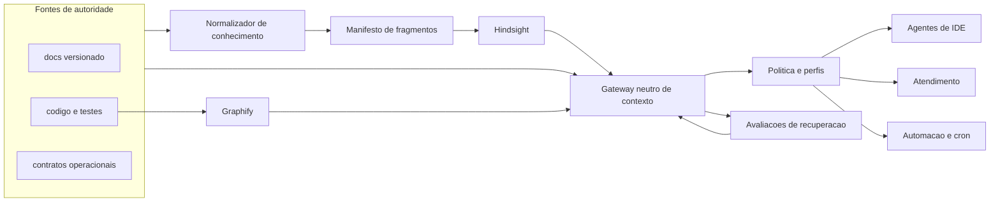

# Evolução do RAG e consumo por agentes

## Objetivo

Transformar a memória evolutiva numa camada de contexto portátil que possa ser consumida
por Codex, Claude, Hermes, IDEs, agentes de atendimento e executores agendados sem fazer
de nenhum modelo, fornecedor ou banco a fonte da verdade.

A promessa verificável não é “qualquer LLM saberá tudo”. É:

> Todo conhecimento canônico dentro do escopo declarado pode ser recuperado com origem,
> versão, validade e permissão; qualquer ausência permanece explícita e mensurável.

## Invariantes

1. Git, `docs/`, código, testes e contratos continuam canônicos.
2. Hindsight, Graphify e qualquer índice futuro têm autoridade zero e são reconstruíveis.
3. Resultado recuperado precisa voltar à fonte antes de virar afirmação.
4. Memória de projeto, memória de conversa e estado operacional nunca compartilham a
   mesma jurisdição por conveniência.
5. Documentação pode evoluir sem revisão humana obrigatória; efeitos externos continuam
   limitados pela política operacional versionada.
6. Um adaptador de LLM não pode alterar o contrato do conhecimento.
7. Automação sem interação precisa de lock, idempotência, checkpoint e auditoria.
8. Qualidade do RAG é teste de recuperação, não quantidade de vetores.

## Arquitetura-alvo



## Três memórias que não podem ser confundidas

| Camada | Exemplos | Dono | Persistência |
|---|---|---|---|
| Projeto | arquitetura, regras, decisões, runbooks | repositório | Git + índices derivados |
| Conversa | contexto do atendimento, preferências daquela sessão | plataforma do agente | TTL e isolamento por sessão/tenant |
| Operação | pedido, job, ambiente, tentativa, efeito e rollback | sistema transacional | banco/filas/auditoria do produto |

Esta biblioteca é dona da primeira camada. Pode fornecer contratos para consultar as
outras duas, mas não deve copiá-las para `docs/` ou para o bank do projeto.

## Contrato neutro de recuperação

O consumidor não deve receber o JSON particular do Hindsight seguido do texto particular
do Graphify. A saída futura de `memoria contexto --json` terá envelope versionado:

```json
{
  "schema": 1,
  "projeto": "meu-app",
  "pergunta": "como funciona a autenticacao?",
  "perfil": "engenharia-leitura",
  "frescor": "confirmado",
  "fontes": [
    {
      "source_uri": "docs/funcional/FDD-0003.md#regras",
      "source_commit": "0123456789abcdef",
      "doc_id": "FDD-0003",
      "status": "verificado",
      "fragment_id": "FDD-0003:regras",
      "conteudo_sha256": "...",
      "trecho": "..."
    }
  ],
  "codigo": [],
  "avisos": [],
  "acoes_permitidas": []
}
```

O gateway resolve e relê cada `source_uri`, confere hash/status/cadeia e descarta resultado
que não volte a uma fonte atual. CLI, MCP e HTTP apenas transportam esse mesmo envelope.

## Perfis mínimos

| Perfil | Pode ler | Pode escrever | Proibições padrão |
|---|---|---|---|
| `engenharia-leitura` | docs e código | nada | efeitos externos |
| `engenharia-documentacao` | docs e derivados | branch/worktree local | push, deploy e produção |
| `atendimento` | produto, funcional e runbooks publicados | memória efêmera da conversa | código interno, segredos e mutações |
| `automacao-codigo` | escopo declarado do repositório | worktree isolada | publicação sem política explícita |
| `operacao-assistida` | contexto autorizado do ambiente | ferramentas nomeadas | SQL/shell/URL genéricos |

O modelo escolhe respostas dentro do perfil; não escolhe o próprio perfil nem amplia
capacidades. Autenticação, tenant, transação, idempotência, rate limit e auditoria
continuam sob responsabilidade do sistema que executa a ferramenta.

## Fases e gates

### Fase 0 — integridade das instruções portáteis

Estado: **implementada localmente nesta evolução**.

- `memoria skill --conferir` falha se runbook, gerador ou artefato divergir;
- marcador da skill tem schema, versão, pasta de saída e hashes;
- CI executa a conferência quando a skill existe;
- ausência de skill continua sendo ausência explícita, não falsa confirmação.

Aceite: alterar uma linha do runbook ou do `SKILL.md` faz o comando retornar código 1;
regenerar restaura o verde.

### Fase 1 — RAG determinístico por fragmento

Estado: **implementada localmente na versão 3.3, em modo sombra**.

- parser Markdown independente de LLM;
- fronteiras próprias para seção, cronologia, glossário e `ABERTO`;
- `fragment_id` estável e `source_uri` com âncora;
- manifesto versionado com hash de fonte, fragmento e algoritmo;
- fingerprint do perfil Hindsight: versão, extração, chunking e embedding;
- mudança de algoritmo/perfil força reconstrução completa;
- documento removido purga todos os seus fragmentos;
- `superado` permanece histórico, excluído da consulta normal.

Aceite: duas execuções sobre os mesmos bytes produzem manifesto idêntico; qualquer
fragmento retornado aponta para uma âncora existente e reproduzível.

O Hindsight ainda mantém os documentos inteiros. O manifesto fragmentado é gerado e
verificado em paralelo, com o perfil declarado no `padrao.json`; essa separação permite
comparar a próxima recuperação sem apagar ou converter o bank atual.

### Fase 2 — gateway neutro de contexto

Estado: **implementada localmente na versão 3.4**.

- `memoria contexto --pergunta=... --perfil=... --json`;
- saída JSON estável, sem texto decorativo no stdout;
- busca semântica, literal e estrutural combinadas;
- resolução automática da fonte e verificação de frescor;
- orçamento de tokens e deduplicação;
- adaptadores CLI, MCP e HTTP sobre a mesma função interna.
- comparação sombra explícita, mantendo `migracao_hindsight_liberada: false`;
- retorno estritamente read-only: `acoes_permitidas` permanece vazio.

Aceite: os três transportes devolvem o mesmo envelope normalizado para a mesma consulta.

### Fase 3 — adaptadores de agentes

Estado: **implementada localmente na versão 3.5**.

- manifesto neutro de adaptadores;
- Codex/AGENTS, Claude, Cursor, Windsurf e Hermes gerados da mesma fonte;
- instalação e descoberta específicas por plataforma, sem copiar fatos;
- canary que confirma projeto, bank, perfil e commit antes da primeira consulta;
- skill/adaptador desatualizado bloqueia o gate.

O manifesto `docs/gerado/manifesto-adaptadores-v1.json` e os adaptadores são
reconstruídos por `memoria documentar`. `memoria adaptadores canary` confirma os quatro
identificadores antes de liberar a consulta. Configurações globais de Windsurf e Hermes
não são alteradas: seus arquivos de contexto versionados descobrem a CLI neutra.

Aceite: uma sessão nova em cada plataforma encontra a porta de entrada, recupera as
mesmas fontes e respeita as mesmas proibições.

### Fase 4 — atendimento e controle de acesso

Estado: **implementada localmente na versão 4.0**.

- classificação `publico`, `interno`, `restrito` e `secreto-nao-indexar`;
- `audience` e perfil permitidos por documento/fragmento;
- filtro exato por produto/tenant, obrigatório para atendimento e operação;
- redaction determinística e auditável antes do retain;
- fontes obrigatórias e `cobertura: ausente` quando a pergunta não está coberta;
- conversa e dados do cliente fora da memória do projeto.

Aceite: testes negativos provam que o perfil de atendimento não recupera código interno,
segredo, outro tenant ou documento fora da audiência.

### Fase 5 — executor autônomo e cron

Estado: **implementada localmente na versão 5.0**.

- comando não interativo com `--json` e códigos de saída documentados;
- lock por projeto e detecção de execução concorrente;
- `run_id` idempotente, checkpoints e retomada;
- retry com backoff e timeout global;
- worktree/branch isolada para escrita de código ou documentação;
- diff e validação antes de qualquer publicação;
- nenhuma mutação externa sem capacidade previamente concedida.

Aceite: repetir o mesmo `run_id` não duplica efeitos; interrupção após cada checkpoint
pode ser retomada; duas execuções simultâneas não corrompem docs nem bancos.

### Fase 6 — evolução mensurada

Estado: **implementada localmente na versão 6.0**.

- conjunto versionado de perguntas, respostas esperadas e fontes;
- métricas `hit@1`, `hit@3`, cobertura de citação e taxa de resposta sem fonte;
- casos separados para engenharia, atendimento e automação;
- baseline e catraca de regressão;
- promoção de documento ao núcleo baseada em uso medido;
- relatório de drift por algoritmo, modelo e perfil.

Aceite: troca de embedding, chunking ou provedor só é aceita se mantiver a catraca e
produzir um manifesto reconstruível.

## Ordem de implementação

1. concluir a Fase 0 e manter compatibilidade com projetos sem skill gerada;
2. implementar manifesto e fragmentador da Fase 1 sem alterar ainda o bank existente — concluído localmente;
3. criar o gateway da Fase 2 e validar a recuperação em paralelo — concluído localmente;
4. adicionar adaptadores e perfis — concluído localmente;
5. adicionar classificação, isolamento e redaction — concluído localmente;
6. implementar o executor idempotente da Fase 5 — concluído localmente;
7. implementar a avaliação e catraca da Fase 6 — concluído localmente;
8. migrar Hindsight por fragmento somente depois da paridade mensurada.

Não se começa por MCP, interface de chat ou scheduler. Sem fragmentos reproduzíveis,
fonte resolvida e perfil de acesso, essas interfaces apenas distribuem respostas
inconsistentes com mais velocidade.

## Migração e compatibilidade

- o schema documental atual continua válido;
- marcadores antigos nunca são tratados como prova do schema novo;
- a migração do Hindsight é reconstrução a partir de `docs/`, não conversão de memórias;
- o Graphify continua especializado em código;
- novos campos são compatíveis: ausência de classificação significa `interno`, e listas
  vazias de produto/tenant significam documento global; atendimento continua exigindo
  escopo explícito na requisição;
- cada fase pode ser entregue e revertida sem tornar Hindsight ou Graphify canônicos.

## Definição de pronto da próxima entrega

A próxima entrega é a **migração controlada do Hindsight para fragmentos**. Ela só pode
começar com baseline verde e termina quando a recuperação fragmentada mantém as métricas
por perfil, permite reconstrução integral e preserva rollback para documentos inteiros.
